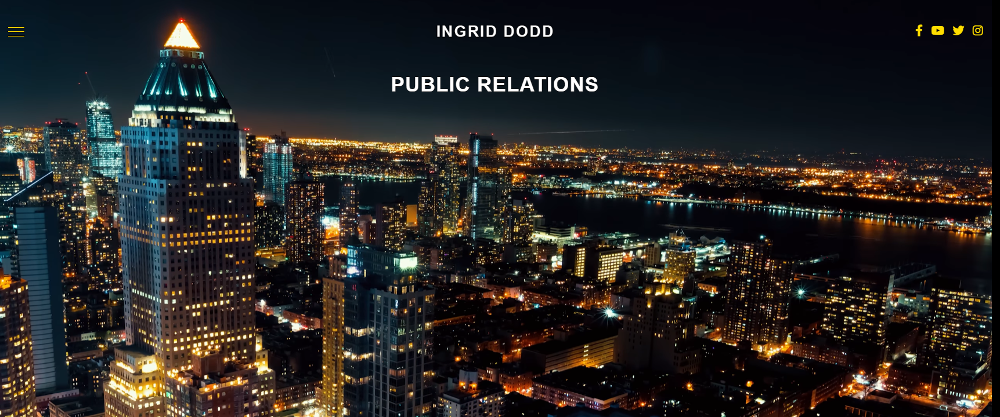
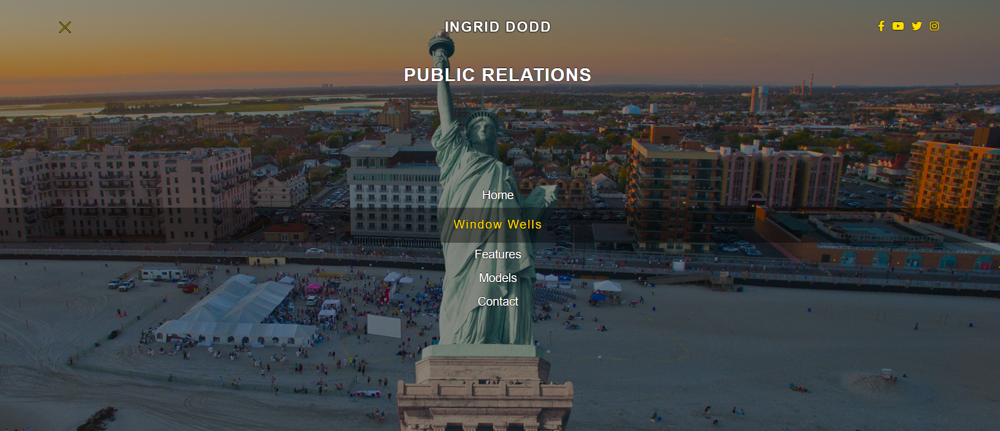

# Ingrid Dodd PR (real order)

[Here you can check it](https://artemuholkov.github.io/ingrid_dodd_pr/)

---

I didn't have figma design for this project.
This website is 100% responsive for all types of screens.
I used HTML, CSS, JS in this project.

---

###What was interesting in this project:

1. I had to create multipage website using HTML, CSS, JS and then I had to upload it to wordpress CMS, but at one moment customer asked to create full website on Avada Theme in WordPress. So here is a full result:

[ingriddoddpr.com](https://ingriddoddpr.com/)

2. Full screen menu, where burger icon slowly changing to X mark and menu sliding down over background video.

---
